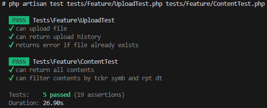

# Desafio Oliveira Trust API

Esta é uma aplicação desenvolvida em PHP utilizando o framework Laravel. A API permite a importação de planilhas Excel contendo dados financeiros, o armazenamento de informações dos arquivos enviados e a consulta de conteúdos processados com base em filtros como código do ativo (TckrSymb) e data de referência (RptDt).

## Arquitetura, Padrões e Princípios de Projeto

- **SOLID**: A aplicação segue os princípios SOLID para garantir que o código seja escalável, manutenível e de fácil compreensão.
- **Clean Architecture**: A arquitetura da aplicação é baseada no conceito de Clean Architecture, separando as preocupações e facilitando testes e manutenção.
- **API RESTful com Maturidade de Richardson e HATEOAS**: Os endpoints da API são projetados seguindo os princípios RESTful e incorporam a maturidade de Richardson para oferecer diferentes níveis de abstração. Além disso, implementamos HATEOAS para fornecer links que permitem a navegação entre recursos relacionados, melhorando a interatividade e a descoberta da API.
- **Data Transfer Object (DTO)**: Os objetos de transferência de dados (DTO) são utilizados para encapsular os dados que serão transferidos entre as camadas da aplicação.
- **Repository Pattern**: Utiliza-se o padrão Repository para abstrair a lógica de acesso a dados, permitindo uma maior flexibilidade e testabilidade.
- **Camada de Service**: A lógica de negócio está centralizada em uma camada de Service, promovendo a reutilização de código, clareza e respeito ao princípio da responsabilidade única.
- **Jobs (Filas de Processamento Assíncrono)**: Tarefas demoradas ou que não precisam ser processadas em tempo real são delegadas a Jobs melhorando o desempenho.
- **Testes Unitários com Phpunit**: A aplicação conta com dois testes unitários que garantem a confiabilidade do código, além de contribuírem para a documentação do comportamento esperado.

## Requisitos

Antes de começar, verifique se você possui as seguintes ferramentas instaladas em sua máquina:

- [Docker](https://www.docker.com/get-started)
- [Docker Compose](https://docs.docker.com/compose/install/)

## Configuração do Ambiente

### 1. Clone o Repositório
```bash
git clone https://github.com/Gierdiaz/desafio-desenvolvedor.git

```

### 2. Navegue até o Diretório do Projeto
```bash
cd desafio-desenvolvedor
```

### 3. Entre na branch
```bash
git checkout allison-luis-de-oliveira-dias
```


###  4. Crie um arquivo .env
Copie o arquivo .env.example e renomeie-o para .env. Configure as variáveis de ambiente conforme necessário.

- **Linux/macOS**:
```bash
cp .env.example .env
```

- **Windows (CMD)**:
```bash
copy .env.example .env
```

Exemplo para configurar as seguintes variáveis de ambiente para o banco de dados Postgres:
```plaintext
DB_CONNECTION=pgsql
DB_HOST=postgres
DB_PORT=5432
DB_DATABASE=desafio_oliveira_trust
DB_USERNAME=postgres
DB_PASSWORD=
```

###  5. Construir e Iniciar os Contêineres
Para construir a imagem Docker e iniciar todos os serviços, execute:
```bash
docker-compose up --build -d
```

###  6. Instale as Dependências do Composer
Para instalar as dependências do Composer, execute:
```bash
docker exec app composer install
```

###  7. Gerar uma Nova Chave de Criptografia
Use o Artisan para gerar uma nova chave de criptografia
```bash
docker-compose exec app php artisan key:generate
```

### 8. Acesse a Aplicação
Após a construção e inicialização dos contêineres, você poderá acessar a aplicação em:
```bash
http://localhost:8080/api/
```

### 9.  Parar os Contêineres
Para parar os contêineres, você pode usar:
```bash
docker-compose down
```

## Executando o Worker da Fila
Antes de enviar arquivos grandes (ex: com 75 mil linhas), você precisa garantir que o worker da fila esteja em execução para processar os jobs:
```bash
php artisan queue:work
```

# Acessar o Postgres no container
Depois que o container do Postgres estiver em execução, você pode acessá-lo diretamente usando o seguinte comando:

### Entrou no container
```bash
docker exec -it postgres sh
```

### Entrou no psql
```bash
psql -U postgres -d desafio_oliveira_trust
```

Comandos para gerenciar o banco de dados
Após acessar o Postgres no container, você pode executar os seguintes comandos:

###  Mostrou todas as tabelas
```sql
\dt
```

### Mostrou todos os registros da tabela uploads
```sql
SELECT * FROM uploads;
```

### Mostrou todos os registros da tabela contents
```sql
SELECT id, upload_id, "RptDt", "TckrSymb", "MktNm", "SctyCtgyNm", "ISIN", "CrpnNm"
FROM contents;

```

### Saiu do psql
```sql
\q
```

###  10. Execute as Migrações do Banco de Dados
Para criar as tabelas no banco de dados, execute:
```bash
docker exec app php artisan migrate:fresh
```

# Comando de Teste
Executando o Comando no Projeto
Para executar os testes utilize o seguinte comando:

### Para executar o teste com Phpunit:
Executa os testes automatizados da aplicação usando o Phpunit
```bash
docker exec app php artisan test tests/Feature/UploadTest.php tests/Feature/ContentTest.php

```


### Para executar o PHP Code Sniffer (Pint):
Formata e verifica o código PHP da sua aplicação, garantindo que ele siga os padrões de codificação.
```bash
docker exec app ./vendor/bin/pint
```
# Endpoints da API

## Autenticação

### Registrar Usuário

- **Método:** POST  
- **Endpoint:** `/api/auth/register`  
- **Corpo da Requisição:**
```json
  {
    "name": "Nome do Usuário",
    "email": "usuario@example.com",
    "password": "SenhaSegura123!",
    "password_confirmation": "SenhaSegura123!"
  }

```
- **Resposta:**
```json
  {
    "message": "User registered successfully"
  }
```
### Login

- **Método:** POST  
- **Endpoint:** `/api/auth/login`  
- **Corpo da Requisição:**
```json
{
  "email": "usuario@example.com",
  "password": "SenhaSegura123!"
}

```

- **Resposta:**
```json
{
  "access_token": "TOKEN_DE_AUTENTICAÇÃO",
  "token_type": "Bearer"
}
```
### Logout

- **Método:** POST  
- **Endpoint:** `/api/auth/logout`  
- **Autenticação:** Bearer Token  
- **Resposta:**
```json
  {
    "message": "Logged out successfully"
  }
```
## Upload

### Importação do arquivo 

- **Método:** POST  
- **Endpoint:** `/api/v1/uploads`  
- **Resposta:**
```json
{
    "data": {
        "file_name": "InstrumentsConsolidatedFile_20250606_1.csv",
        "file_path": "files/InstrumentsConsolidatedFile_20250606_1.csv"
    }
}
```

### Histórico dos uploads

- **Método:** GET  
- **Endpoint:** `/api/v1/upload-history`  
- **Resposta:**
```json
{
    "data": [
        {
            "file_name": "registro_unico.csv",
            "reference_date": "2025-06-08"
        },
        {
            "file_name": "dados.csv",
            "reference_date": "2025-06-08"
        },
        {
            "file_name": "registro.csv",
            "reference_date": "2025-06-08"
        },
        {
            "file_name": "InstrumentsConsolidatedFile_20250605_1.csv",
            "reference_date": "2025-06-08"
        }
    ],
    "links": {
        "first": "http://desafio-oliveira-trust.test/api/v1/upload-history?page=1",
        "last": "http://desafio-oliveira-trust.test/api/v1/upload-history?page=1",
        "prev": null,
        "next": null
    },
    "meta": {
        "current_page": 1,
        "from": 1,
        "last_page": 1,
        "links": [
            {
                "url": null,
                "label": "&laquo; Previous",
                "active": false
            },
            {
                "url": "http://desafio-oliveira-trust.test/api/v1/upload-history?page=1",
                "label": "1",
                "active": true
            },
            {
                "url": null,
                "label": "Next &raquo;",
                "active": false
            }
        ],
        "path": "http://desafio-oliveira-trust.test/api/v1/upload-history",
        "per_page": 10,
        "to": 4,
        "total": 4
    }
}
```
## Content

### Contents sem parâmetros com paginação

- **Método:** GET  
- **Endpoint:** `/api/v1/contents`  
- **Resposta:**
```json
{
    "data": [
        {
            "RptDt": "2025-06-05",
            "TckrSymb": "003H11",
            "MktNm": "EQUITY-CASH",
            "SctyCtgyNm": "FUNDS",
            "ISIN": "BR003HCTF006",
            "CrpnNm": "KINEA CO-INVESTIMENTO FDO INV IMOB",
            "_links": {
                "self": "http://desafio-oliveira-trust.test/api/v1/contents?TckrSymb=003H11&RptDt=2025-06-05"
            }
        },
        {
            "RptDt": "2025-06-05",
            "TckrSymb": "A1AP34Q",
            "MktNm": "EQUITY-CASH",
            "SctyCtgyNm": "BDR",
            "ISIN": "BRA1APBDR001",
            "CrpnNm": "ADVANCE AUTO PARTS INC",
            "_links": {
                "self": "http://desafio-oliveira-trust.test/api/v1/contents?TckrSymb=A1AP34Q&RptDt=2025-06-05"
            }
        },
    ],
    "links": {
        "first": "http://desafio-oliveira-trust.test/api/v1/contents?page=1",
        "last": "http://desafio-oliveira-trust.test/api/v1/contents?page=7",
        "prev": null,
        "next": "http://desafio-oliveira-trust.test/api/v1/contents?page=2"
    },
    "meta": {
        "current_page": 1,
        "from": 1,
        "last_page": 7,
        "links": [
            {
                "url": null,
                "label": "&laquo; Previous",
                "active": false
            },
            {
                "url": "http://desafio-oliveira-trust.test/api/v1/contents?page=1",
                "label": "1",
                "active": true
            },
        ],
        "path": "http://desafio-oliveira-trust.test/api/v1/contents",
        "per_page": 10,
        "to": 10,
        "total": 63
    }
}
```

### Contents com parâmetros sem paginação

- **Método:** POST  
- **Endpoint:** `/api/v1/contents?TckrSymb=003H11&RptDt=2025-06-05`  
- **Parâmetros:** `TckrSymb`, `RptDt`  
- **Corpo da Requisição:**
```json
{
    "data": [
        {
            "RptDt": "2025-06-05",
            "TckrSymb": "003H11",
            "MktNm": "EQUITY-CASH",
            "SctyCtgyNm": "FUNDS",
            "ISIN": "BR003HCTF006",
            "CrpnNm": "KINEA CO-INVESTIMENTO FDO INV IMOB"
        },
        {
            "RptDt": "2025-06-05",
            "TckrSymb": "003H11",
            "MktNm": "EQUITY-CASH",
            "SctyCtgyNm": "FUNDS",
            "ISIN": "BR003HCTF006",
            "CrpnNm": "KINEA CO-INVESTIMENTO FDO INV IMOB"
        }
    ]
}
```